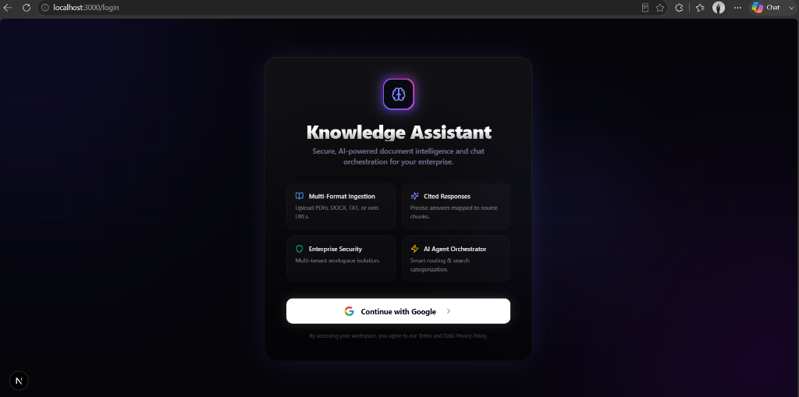
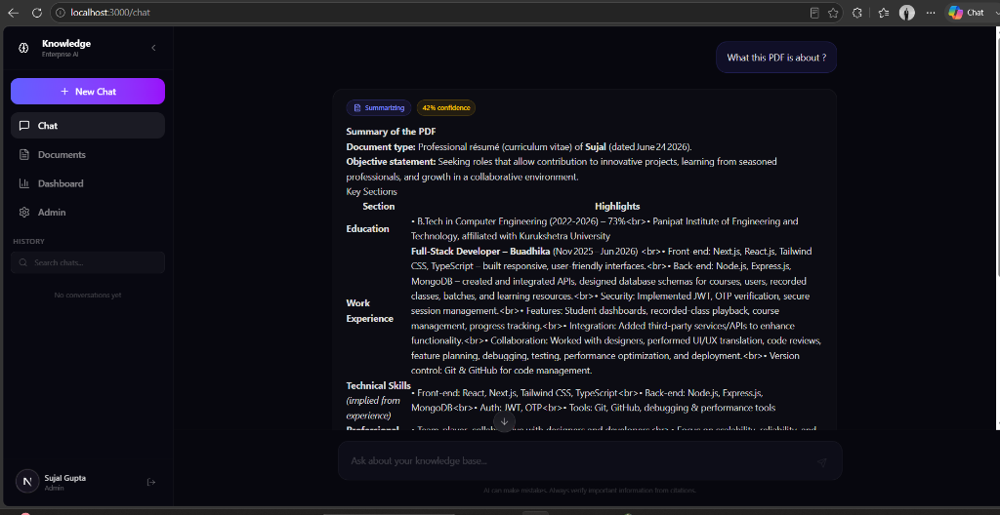
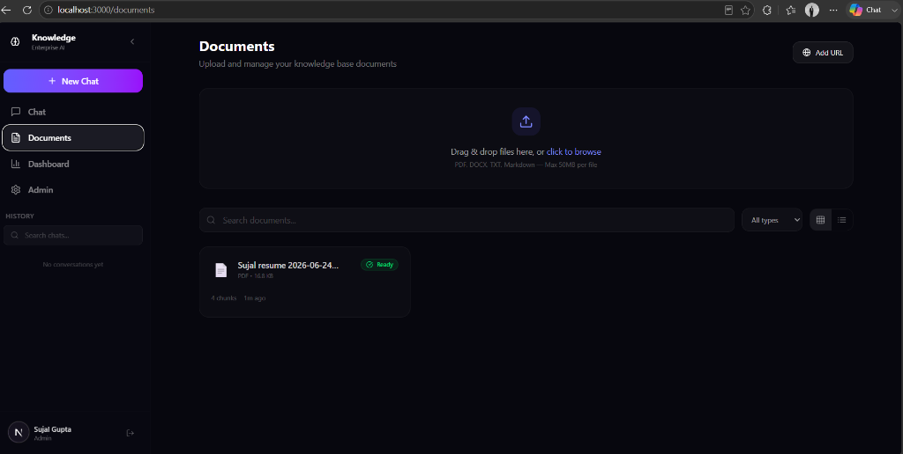
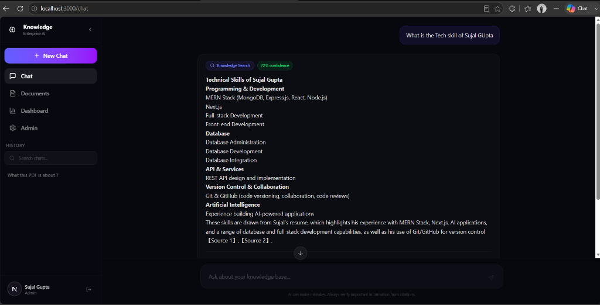

# 🧠 Enterprise Knowledge Assistant

> AI-powered RAG application that lets organizations chat with their internal knowledge base. Upload documents, ask questions, get accurate citation-backed answers.


## 📸 Screenshots

| 🔐 Login Screen | 📄 Document Summarization |
|:---:|:---:|
|  |  |

| 📁 Documents Management | 🤖 Citations & Answers |
|:---:|:---:|
|  |  |

## ✨ Features

### 🔐 Authentication
- Google OAuth via Auth.js v5
- JWT session management
- Role-based access control (Admin / Member)
- Multi-tenant organization support

### 📄 Knowledge Base
- Upload **PDF, DOCX, TXT, Markdown** files
- Ingest web pages via **URL**
- Automatic text extraction, cleaning, chunking
- Local embedding generation via **BAAI/bge-small-en-v1.5**
- Vector storage in **ChromaDB**
- Re-index and delete documents

### 🤖 AI Agent
- **Query classification** — routes queries to the right pipeline
- **RAG retrieval** — vector similarity search with citations
- **Document summarization** — condense long documents
- **Chat history search** — find info from past conversations
- **Direct answers** — respond without retrieval when appropriate
- **Follow-up suggestions** — smart question recommendations

### 💬 Chat Interface
- **Streaming responses** via Vercel AI SDK
- Markdown rendering with syntax highlighting
- Source citation cards (expandable)
- Confidence score badges
- Conversation history with search
- Suggested starter prompts

### 📊 Dashboard
- Document count & storage usage
- Query analytics over time
- Popular document tracking
- Response latency distribution

### 🚀 Production Features
- Docker support (multi-stage build)
- Redis rate limiting (with in-memory fallback)
- Structured JSON logging (Pino)
- Custom error hierarchy
- Responsive mobile UI

---

## 🛠 Tech Stack

| Layer | Technology |
|-------|-----------|
| Framework | Next.js 15 (App Router) |
| Language | TypeScript |
| Styling | Tailwind CSS 4 |
| Auth | Auth.js v5 + Google OAuth |
| Database | MongoDB + Mongoose |
| Vector DB | ChromaDB |
| Cache | Redis (ioredis) |
| LLM | Groq (openai/gpt-oss-120b) |
| Embeddings | BAAI/bge-small-en-v1.5 (384-dim, local) |
| AI SDK | Vercel AI SDK |
| RAG | LangChain.js (text splitters) |
| Charts | Recharts |

---

## 🚀 Quick Start

### Prerequisites
- Node.js 18+
- Docker & Docker Compose (for MongoDB, ChromaDB, Redis)
- Google Cloud project with OAuth credentials
- Groq API key

### 1. Clone & Install

```bash
cd RAg
cp .env.example .env.local
npm install --legacy-peer-deps
```

### 2. Configure Environment

Edit `.env.local` with your credentials:

```env
AUTH_SECRET=<generate with: npx auth secret>
GOOGLE_CLIENT_ID=<from Google Cloud Console>
GOOGLE_CLIENT_SECRET=<from Google Cloud Console>
GROQ_API_KEY=<from console.groq.com>
GROQ_MODEL=openai/gpt-oss-120b
MONGODB_URI=mongodb://localhost:27017/knowledge-assistant
CHROMA_URL=http://localhost:8000
REDIS_URL=redis://localhost:6379
```

### 3. Start Infrastructure

```bash
docker-compose up -d
```

This starts MongoDB (27017), ChromaDB (8000), and Redis (6379).

### 4. Run Development Server

```bash
npm run dev
```

Open [http://localhost:3000](http://localhost:3000)

---

## 📁 Project Structure

```
server/
└── ai/                          # Modular, provider-independent AI layer (Groq + HF)
src/
├── app/
│   ├── (auth)/login, onboarding    # Auth pages
│   ├── (app)/chat, documents, ...   # App pages
│   └── api/                         # API routes
├── components/
│   ├── layout/Sidebar               # App shell (with custom Sign Out modal)
│   ├── chat/ChatPageClient          # Chat interface
│   ├── documents/DocumentsClient    # Document management
│   └── dashboard/DashboardClient    # Analytics
├── lib/
│   ├── ai/                          # Document processing & vector store (ChromaDB)
│   ├── mongodb, redis, mongoose     # Data layer
│   └── rate-limiter, logger, errors # Production utilities
├── models/                          # Mongoose schemas
└── types/                           # TypeScript definitions
```

---

## 🐳 Docker Deployment

```bash
# Build the app
docker build -t knowledge-assistant .

# Run everything
docker-compose -f docker-compose.yml up -d
docker run -p 3000:3000 --env-file .env.local knowledge-assistant
```

---

## 📡 API Endpoints

| Method | Endpoint | Description |
|--------|----------|-------------|
| POST | `/api/chat` | Send message (streaming) |
| GET | `/api/documents` | List documents |
| POST | `/api/documents` | Upload document |
| DELETE | `/api/documents/[id]` | Delete document |
| PATCH | `/api/documents/[id]` | Re-index document |
| POST | `/api/documents/url` | Ingest URL |
| GET | `/api/conversations` | List conversations |
| GET | `/api/conversations/[id]` | Get conversation |
| GET | `/api/admin/analytics` | Dashboard analytics |

---

## 📜 License

MIT
